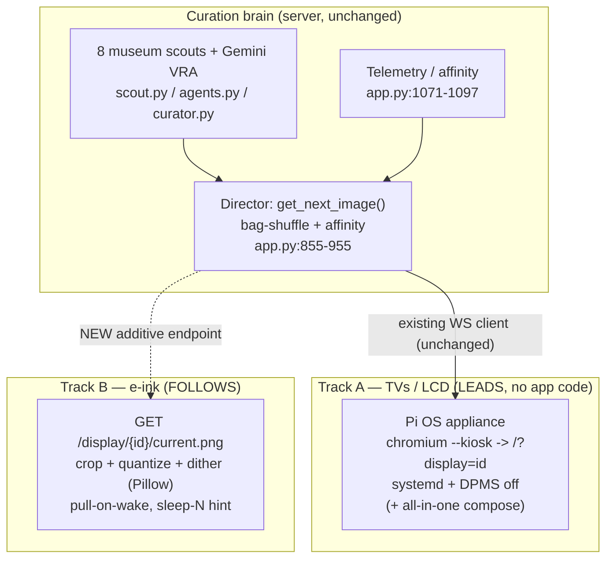

# Screen Docent — Display Strategy Roadmap (e-ink + ease-of-use)

> **Type:** Strategic roadmap / ADR-in-waiting — *not* an implementation spec.
> **Guiding star:** make the best, easiest app for the purpose; raise awareness that a
> thoughtful, robust solution exists; listen to feedback; iterate. No bet-the-farm commercial
> device play yet — everything below stays **additive** to the app that exists today.

---

## Context — why this is on the table

E-ink (Spectra 6 and successors) is crossing into "worthy of digital art," and small products
are appearing around it. The read: digital art display will trend toward e-ink long-term, with a
long tail of other panels, and demand will grow as prices fall and low-power draw makes
**battery-powered frames** viable. The strategic question: *how does Screen Docent capture that
install base, and is the browser dependency hurting?*

Today Screen Docent stacks **two dependencies** on the display device itself:

1. **A capable browser** running a *persistent, animated, always-connected* web client
   (`static/index.html` + `static/app.js`): a WebSocket to `/ws/{display_id}`
   (`app.py:994`), a 45s Ken Burns GPU pan, a 2s crossfade, a hidden looping `<video>`
   "sleep defeater" (`static/index.html:13`), and telemetry heartbeats. There is no
   offline/cache path — it needs a live server.
2. **A kiosk shell** (Fully Kiosk Browser) to make that browser fullscreen, auto-starting,
   URL-locked, and awake (recommended at `static/help.html:280`). This is a third-party tool the
   project doesn't control — the source of the "clunky" onboarding.

These are *different problems with different futures*, and conflating them is what makes the path
look murky.

---

## The thesis

> **Don't build a heavier client. For TVs, replace the shell you don't own. For e-ink, build a
> near-zero client and move all intelligence to the server.**

- The browser itself isn't the enemy — browsers are capable and ubiquitous. Two things hurt:
  (a) the *shell* is outsourced, and (b) the Canvas client **assumes the panel can run a live,
  animated, always-connected web page** — true for TVs, **false for e-ink**.
- E-ink is not "another browser target," it's a different machine: no motion (ghosting / slow
  refresh), a tiny palette (~6 colors → needs gamut mapping + dithering to look good), and battery
  frames **wake briefly, draw once, sleep for hours** (a persistent WebSocket + animation loop is
  the worst possible model). Many cheap/DIY e-ink frames have no real browser at all; the dominant
  pattern across DIY and open frames — and commercial bring-your-own-server devices like TRMNL — is
  to **HTTP GET a server-rendered image on a wake schedule.**
- Defensible value was never the display — it's the **curation brain**: the Director's
  bag-shuffle + affinity weighting in `get_next_image()` (`app.py:855-955`), the telemetry/affinity
  loop (`app.py:1071-1097`), the 8 museum scouts (`scout.py`), and the Gemini VRA metadata pipeline
  (`agents.py` / `curator.py`). Panels are commoditizing. Winning posture: **own the brain, render
  beautifully onto whatever panel exists, make onboarding one step.**

---

## Two tracks

### Track A — TVs / LCD: own the shell, kill the friction (LEADS)

Goal: a new owner gets art on a TV-class screen in **one step**, with **no Fully Kiosk** and no
"find the server IP and type a URL." You don't *write* a browser — you wrap Chromium you already
trust.

- **Flashable appliance image — Raspberry Pi OS first.** A Raspberry Pi OS (Bookworm,
  Wayland/labwc) image that boots straight into `chromium --kiosk` pointed at
  `http://<server>/?display=<id>`, launched by a systemd unit, with screen-blanking/DPMS disabled.
  On an OS we control, the existing `<video>` sleep-defeater (`static/index.html:13`) becomes
  unnecessary. A generic Debian / stick-PC recipe is a natural follow-on.
- **Display-only (client) mode is the primary, production path — not just a first cut.** Validated
  against a real install (Samsung QM55R 4K signage): a thin-client Pi runs *only* the Chromium kiosk
  (~5–7 W — cool and small enough to tuck into the panel's shallow rear recess) and points at the
  central server (e.g. the MS-01). The display device never runs the server. This is what most
  installs actually want.
- **All-in-one variant (single-frame customer) — secondary / optional.** For users *without* a
  separate server, the same image *can also* run the FastAPI server via the existing
  `docker-compose.yml` (port `8000`, persisting `./Artwork` and `./data`), so one box = server +
  display. Nice for the product story, but **not required** when a central server already exists
  (the common case).
- This removes **both** pain points at once and is the most direct expression of "easiest app for
  the purpose." It changes **no application code** — it's packaging/ops around the current client
  (`app.py`, `static/app.js`, and the data model in `models.py` are untouched).
- **Status:** built — display-only **and** all-in-one provisioning are in
  [`deploy/appliance/`](deploy/appliance/README.md) (a pre-baked flashable `.img` is still TODO).

### Track B — e-ink / low-power / battery frames: become the brain (FOLLOWS)

Goal: any **open, DIY, or bring-your-own-server (BYOS)** frame — DIY ESP32 + Waveshare, Inky/PaperPi
on a Pi, open Spectra 6 frames like Paper 7, commercial BYOS devices like TRMNL — can show Screen
Docent's curation **without a browser, WebSocket, or kiosk shell.**

- **Stateless per-display image endpoint**, sketch:
  `GET /display/{id}/current.(png|bmp)?w=1600&h=1200&palette=spectra6`. It reuses the existing
  selection logic in `get_next_image()` (`app.py:855-955`) — playlist resolution, bag-shuffle, and
  affinity weighting — to render the *currently scheduled* image, crops to the panel's exact
  dimensions, and applies **palette quantization + Floyd–Steinberg dithering server-side**. Pillow
  is already a core dependency (`requirements.txt`), used today only for resize/JPEG in
  `get_optimized_image()` (`app.py:102-112`); **no quantization or dithering exists yet**, so this
  is genuinely new capability rather than a rewrite.
- **Pull-on-wake cadence:** device wakes → GETs its image → sleeps. The response carries a
  "sleep N seconds" hint so the **Director controls refresh cadence per content** — no persistent
  connection, no heartbeat (the opposite of the always-on `/ws/{display_id}` model).
- **Proof point — the protocol already ships.** TRMNL devices poll a server, receive JSON with an
  `image_url`, download a PNG/BMP, then cut WiFi and deep-sleep for a `refresh_rate` — exactly this
  pull-on-wake model — and officially support BYOS (bring-your-own-server). Screen Docent's endpoint
  can double as a TRMNL BYOS backend, so a shipping commercial device validates the design, not just
  DIY rigs. The DIY ESP32 + Waveshare world uses the same "fetch a BMP/bitmap over HTTP" pattern
  (often with server-side Floyd–Steinberg dithering already).
- **Bonus — rescues old / limited built-in browsers.** Some smart displays have a built-in browser
  that's too old to render the JS Canvas app but can still show a *plain image*. Confirmed case: the
  Samsung QMR's Tizen MagicINFO **URL Launcher** fails on the app (the reason the Fire TV + Fully
  Kiosk detour happened) yet could point at this endpoint — with a small meta-refresh wrapper or the
  panel's own content scheduler for rotation — and show art with **no external box**. So this track
  also reaches *locked-but-image-capable* panels, not only e-ink frames.
- **"Looks good on e-ink" as a real feature**, not a checkbox: gamut mapping, contrast/brightness
  pre-boost, per-panel dither tuning. This is a genuine differentiator and a place the existing
  Pillow/Gemini pipeline helps.
- Purely **additive** — the TV Canvas client (`static/app.js`) is unchanged; this is a parallel,
  dumb-device interface to the same brain.
- **Status:** v1 **built** — `GET /display/{id}/current.{png,bmp}` (advance-per-fetch, reuses the
  bag-shuffle), server-side crop + Floyd–Steinberg dither in [`epaper.py`](epaper.py), palettes
  spectra6 / acep7 / gray4 / gray16, `X-Refresh-After` sleep hint. Unit-tested (`tests/test_epaper.py`).
  Deferred: per-display panel profiles, remote-targeting via a binding table, packed/raw 1-bit BMP.

> **Known limitation / non-target:** this track assumes a frame that can be pointed at an arbitrary
> URL — true for DIY, open-firmware, and BYOS devices, but **not** for cloud/app-locked consumer art
> frames (Meural-style, or app-only Spectra 6 frames such as BLOOMIN8 and the SwitchBot AI Art
> Frame). Those only talk to their vendor cloud and are out of scope unless they expose a BYOS /
> local-URL option. Note too that DIY ESP32 panels ship with **no firmware** — the HTTP-GET behavior
> is the standard *community firmware* pattern you flash, not zero-setup plug-and-play. So the
> addressable target is "open / hackable / BYOS frames," which is large and growing, not "every frame
> on a shelf."

---

## Sequencing & positioning

Given "make it great, raise awareness, iterate":

1. **Now → Track A appliance.** Highest ease-of-use payoff, fixes the friction felt today, touches
   no app code, and produces the artifact that best *demonstrates* "thoughtful, robust solution"
   (a screen that just works on boot). Awareness anchor: "flash a card, plug in HDMI, it's a
   museum."
2. **Then → Track B e-ink endpoint, kept small and additive.** Ship the image API + dither pipeline
   as the strategic bet on the coming e-art wave. Validate against one cheap real panel — a TRMNL in
   BYOS mode or a DIY ESP32 + Waveshare rig — before polishing. This is what lets Screen Docent ride
   e-ink *without* rebuilding the app.
3. **Defer:** native per-platform TV apps (Tizen / webOS / tvOS), a cloud relay for off-LAN battery
   frames, and any hardware-product / commercial commitment. Revisit only if feedback pulls there —
   awareness + iteration first; don't pre-commit the architecture to a business model that isn't
   chosen yet.

---

## Concrete near-term step (Track A — the thing to build first)

A separate, additive **appliance packaging** alongside the repo that does **not** alter the running
app. There is no `deploy/`, `scripts/`, or systemd asset in the repo today, so this is greenfield:

- A new `deploy/` (or `appliance/`) directory containing a Raspberry Pi OS provisioning recipe
  (script or image-build config) that, on a Pi:
  - installs Chromium + a minimal display stack,
  - drops a **systemd unit** launching
    `chromium --kiosk --noerrdialogs --incognito "http://<server>/?display=<id>"`,
  - disables screen blanking / DPMS (the labwc/Wayland equivalent of `xset s off -dpms`),
  - **(all-in-one variant)** installs Docker + runs the existing `docker-compose.yml` stack so
    server + display co-reside on one box.
- A short **"Appliance" section** added to `README.md` and `static/help.html` documenting the
  flash-and-go flow, making the appliance the *default* onboarding path and demoting the current
  Fully Kiosk recommendation (`static/help.html:274-287`) to a "bring-your-own-TV-stick" fallback.
- Keep it OS-packaging only — **no changes** to `app.py`, `static/app.js`, or the data model in
  `models.py` for this step.

> **Files this step would add/touch (later session):** a new `deploy/` (or `appliance/`) directory
> for the provisioning recipe + systemd unit; `README.md` and `static/help.html` for onboarding
> docs. Existing application code stays untouched.

---

## Open questions to revisit after Track A ships

- **Appliance base:** Raspberry Pi OS is the chosen first target. Add a generic Debian / stick-PC
  recipe too, or keep Pi-only until feedback asks?
- **E-ink palette targets:** Spectra 6 first; do we also pre-build 7-color (ACeP) and grayscale
  paths?
- **Off-LAN battery frames:** they want to live anywhere with wifi, not just the LAN — does that
  eventually force an externally reachable endpoint / optional relay? (Defer; LAN-first is fine.)
- **Closed consumer frames:** if a popular cloud-locked frame later opens a BYOS / local-URL mode,
  is a thin per-vendor adapter worth it, or do those stay permanently out of scope?
- **Per-display panel profiles:** store panel dimensions + palette per `display_id` so the image
  endpoint needs no query params. This is a natural extension of `ActiveDisplayModel`
  (`models.py:23-30`), which today stores only `display_id` + `last_seen_at`.

---

## How to validate Track A (when built)

This is packaging, so validation is "does a fresh device just work," not unit tests:

1. Flash the image / run the recipe on a Pi (or VM/stick) and boot with no keyboard attached.
2. Confirm it lands fullscreen on the Canvas (`/?display=<id>`) with **no browser chrome**, **no
   manual URL entry**, and **no Fully Kiosk** involved.
3. Leave it running well past the OS's normal blank/sleep timeout — confirm the screen stays awake
   **without** the `<video>` hack.
4. **(All-in-one)** confirm the co-resident `docker compose` server serves the same box's display
   and the admin UI is reachable from another device on the LAN.
5. Power-cycle — confirm it boots straight back into the display unattended.

---

## Strategy & Direction

Screen Docent occupies a gap nobody else fills: the polished art displays (Samsung The Frame, Meural,
Canvia) are closed, subscription-based, and cloud-locked — several have **bricked their customers'
hardware when the vendor moved on** — while the open, self-hosted tools (MagicMirror, Home Assistant
dashboards, e-ink frameworks) show widgets and photos, not curated art. We aim to be the one thing
that is **open-source, self-hosted, no-subscription, hardware-agnostic (any TV, Pi, or e-ink panel),
and genuinely curated** — with a public-domain museum catalog, AI-written placards, and a model you
choose. You own the brain and your data; nothing we ship can be switched off from afar.

Three directions follow from that:

- **The catalog format is a contribution surface.** The catalog is a simple JSON manifest
  (`index.json` + per-collection files; each item carries placard text + thumbnail + source URL).
  That's deliberately an open interchange format: anyone — a community member, an artist, a museum —
  can publish a collection against the schema, and the app can already load a catalog from a remote
  URL. The goal is a growing, community-contributed catalog, not a closed library.
- **Integrations / plugins.** Meet people on the platforms they already run, as thin adapters over
  the same brain:
  - **Samsung Frame TV (and other "art-mode" TVs).** Frame owners already hack their own images onto
    the set; Screen Docent can instead push *curated* art into Art Mode over the local network — a
    new option for that community that needs no subscription and no cloud. A new "push" output target
    alongside the browser Canvas and the e-ink pull API.
  - **MagicMirror²** module — a quick win: a small module that shows the current artwork + placard
    from a Screen Docent server on the popular smart-mirror platform.
  - **Home Assistant** add-on / dashboard card — art + ambient display as a first-class smart-home
    surface.
  - **e-ink / BYOS image API** (already shipped) as the integration point for the e-ink community
    (e.g. a TRMNL plugin or Inky example).
- **Earn trust first.** Stay genuinely open and self-hostable, keep the core free, and grow with the
  self-hosted / homelab / maker / e-ink communities who share these values — then iterate on what
  they ask for.

## Backlog / Future ideas

Captured from working sessions — not yet scheduled. Roughly ordered by how much they move the
"ease-of-use" needle.

### Onboarding (toward truly bonehead-proof)
- **On-screen admin URL on the frame.** For all-in-one Pi, show `http://<ip>:8000/admin` (and the
  `<hostname>.local` name) on a boot splash while the kiosk waits for the server — so a non-technical
  user reads the address straight off the screen instead of hunting the DHCP lease. *(Partial today:
  mDNS `<hostname>.local` + `avahi-daemon` are documented/installed; the on-screen splash is the gap.)*
- **Pre-baked flashable `.img` with a first-boot WiFi captive portal.** Flash → power on → connect a
  phone to a `Docent-Setup` hotspot → pick WiFi + server URL in a browser → done. Eliminates the
  Raspberry Pi Imager "set WiFi before flashing" cliff entirely. The big lever for non-technical users.

### Catalog → "marketplace"
- **Remote-hosted catalog manifest.** Serve `index.json` + per-collection files from a static URL
  (GitHub raw / object store — no server) so the catalog can grow to thousands and update without an
  app rebuild. *(Backend already supports a `catalog_url` base override with bundled fallback — this
  is mostly publishing + a settings toggle.)*
- **Catalog growth & curation — ✅ stocking push done (2026-06-21): 264 → 687 items, 16 → 24
  collections.** Doubled the canon picks per collection (Impressionism/Post-Impressionism/Ukiyo-e to
  40) and added 8 collections (Baroque, Symbolism & the Pre-Raphaelites, Art Nouveau & Decorative,
  Maps & Cartography, Ancient Egypt & the Near East, Asian Art, Medieval & Illuminated, Marine).
  Added a **Smithsonian (CC0)** pick-resolver; **LoC dropped as a display source** (public derivatives
  cap at 1024px / masters are unrenderable TIFFs — fails the ≥2000px gate; its content is mirrored on
  Wikimedia at full res). Matcher hardened: an **artist-gate** (kills same-keyword wrong-artist
  matches) + **ObjectName scoring** (recovers non-English-titled works like *Das Eismeer*) + the
  builder verify path now **retries Wikimedia 429s** instead of dropping works. *Further growth:* keep
  adding canon picks; the 3D-object/manuscript collections (sculpture, Egypt, medieval) are
  PD-limited (photos of objects are CC-BY-SA, not PD — only museum CC0 fills them).
- **"Marketplace" tiers.** Paid / community-contributed / bring-your-own collections layered on the
  same manifest schema; rights-cleared modern posters (rock/film) where licensing allows.

### Engine & rendering
- **Per-panel e-ink color tuning.** Calibrate the palette RGB anchors against real Spectra 6 / ACeP
  hardware (the current anchors are nominal). Concrete target: a **13" 6-color (Spectra 6) panel** —
  the real device that closes the e-ink loop (drive it from the incoming Pi, fetch the image API,
  eyeball + tune the palette on actual hardware).

### Interactive docent (the "Living Docent") — ambitious, later phase
The marquee experience: on a touchscreen kiosk, a user taps **"Learn more about this piece"** and
Screen Docent *narrates* it — framing and zooming into the regions it's discussing ("notice in the
flowers how the brushwork builds texture…"), eventually as warm audio in a named, trustworthy docent
persona, and finally answering the user's own questions. Builds directly on the new server-hosted
`/art/{id}` page (`app.py`), which already assembles the per-artwork data surface a docent speaks from.
Phasing (each shippable on its own):
- **A — Richer "Learn More" text.** The `/art/{id}` page gains AI-generated expandable sections
  (composition, technique, history) beyond the single placard paragraph. Pure metadata, no new infra.
- **B — Guided visual tour.** Pre-computed **points of interest** (image regions + commentary) that the
  kiosk pans/zooms to while the text scrolls. **Reuses the existing Ken Burns crop/zoom engine**, just
  *scripted per-region* instead of random. The region+commentary data is generated **once** (a vision
  model proposes regions and what to say about each) and **baked like placards are today** — so the
  kiosk does zero per-view model calls (offline-capable, cheap, on-brand with "bake it once").
- **C — Audio docent.** TTS narration of the tour with a named persona voice (someone you trust).
- **D — Conversational Q&A.** Ask about the piece: text input + **STT in, TTS out**; the LLM is grounded
  in the artwork's stored metadata + a retrieved knowledge snippet. The kiosk's touchscreen is the venue.
- **Why it fits:** deepens the one thing competitors don't have (museum-grade *curation + interpretation*,
  not just pretty pixels), and the heavy compute is build-time, not runtime. Needs: a touchscreen kiosk
  deployment profile, a voice/TTS provider decision (local vs. API), and the baked POI schema.

### Later / product validation
- **Giftable 13" e-ink art frame (family Xmas build).** A self-contained 13" Spectra 6 art frame as a
  giftable, dogfood-able unit — the cleanest real-world validation (real users, real rooms, all year).
  Implies: a no-fuss fetch-on-wake client for the panel, an easy "point it at my server" setup, and
  the palette tuning above. Aspirational target on the calendar: **Christmas 2026.**
- **Per-display panel profiles.** Store w/h/palette per `display_id` so the e-ink endpoint needs no
  query params (extends `ActiveDisplayModel`).

### Integrations & plugins
- **Samsung Frame TV push adapter** — ✅ **shipped** *(pending real-Frame beta)* in
  [`frame_push.py`](frame_push.py) + [`integrations/frame-tv/`](integrations/frame-tv/). A "push"
  output target: renders the selected artwork to a full-colour TV-resolution JPEG
  (`epaper.render_fullcolor`) and uploads it into the Frame's Art Mode over the LAN (Samsung's
  unofficial art WebSocket via `samsungtvws`), on a leader-only scheduler, configured in
  Settings → 🖼️ Frame TV. The TV is hidden behind a small `FrameClient` interface so all logic is
  tested against a fake; the live TV handshake is verified via `integrations/frame-tv/push_once.py`
  (no Frame on hand — see beta note). *(Follow-ups: real-hardware beta confirmation; crop-aware
  framing; multi-TV; SSDP auto-discovery.)*
- **MagicMirror² module** — ✅ **shipped** in [`integrations/MMM-ScreenDocent/`](integrations/MMM-ScreenDocent/).
  A front-end-only `MMM-ScreenDocent` module that shows the current artwork + placard from a Screen
  Docent server (consumes `/next-image`; no server changes). Ships a `preview.html` to try it without
  MagicMirror. *(Follow-ups: publish as its own repo + list in the MM 3rd-party registry; optional
  WebSocket live-push.)* **Hold the 3rd-party-registry listing until there's a real launch plan** —
  a hosted demo, a short screen-capture GIF, and a polished README. Listing is a one-shot first
  impression; don't spend it before the rest of the story is ready.
- **Home Assistant add-on / Lovelace card** — see Strategy & Direction.
- **TRMNL plugin / Inky example** over the existing e-ink image API.

### Tech debt
- **Unify the download path — ✅ done (2026-06-21).** Extracted a shared `_download_image_to_library`
  core (descriptive UA + 429 retry/backoff + redirects + collision-safe filename + image validation);
  seed, discovery, and catalog all route through it. Fixed a real bug: the discovery-approve route
  used a bare httpx client (default UA → **Wikimedia/NASA 403**), so approving a Wikimedia/NASA
  discovery could fail — verified live (old bare-UA → 403, new core → 200). 6 new tests
  (`tests/test_download.py`), suite 85 green.
