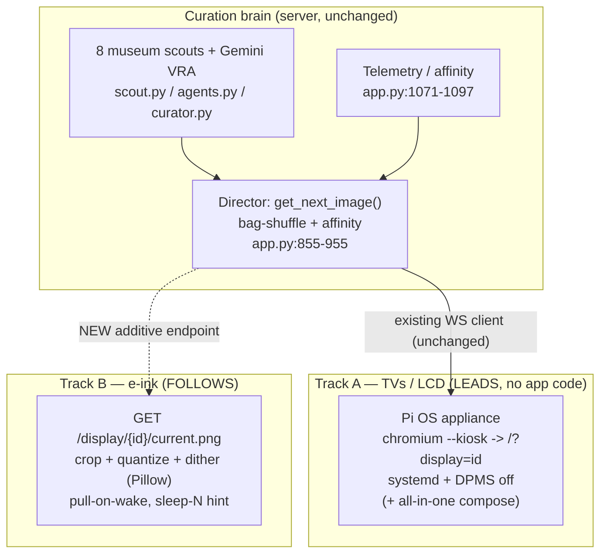

# Screen Docent — Display Strategy Roadmap (e-ink + ease-of-use)

> **Type:** Strategic roadmap / ADR-in-waiting — *not* an implementation spec.
> **Guiding star:** make the best, easiest app for the purpose; raise awareness that a
> thoughtful, robust solution exists; listen to feedback; iterate. No bet-the-farm commercial
> device play yet — everything below stays **additive** to the app that exists today.

---

## Context — why this is on the table

E-ink (Spectra 6 and successors) is crossing into "worthy of digital art," and small products
are appearing around it. The read: digital art display will trend toward e-ink long-term, with a
long tail of other panels, and demand will grow as prices fall and low-power draw makes
**battery-powered frames** viable. The strategic question: *how does Screen Docent capture that
install base, and is the browser dependency hurting?*

Today Screen Docent stacks **two dependencies** on the display device itself:

1. **A capable browser** running a *persistent, animated, always-connected* web client
   (`static/index.html` + `static/app.js`): a WebSocket to `/ws/{display_id}`
   (`app.py:994`), a 45s Ken Burns GPU pan, a 2s crossfade, a hidden looping `<video>`
   "sleep defeater" (`static/index.html:13`), and telemetry heartbeats. There is no
   offline/cache path — it needs a live server.
2. **A kiosk shell** (Fully Kiosk Browser) to make that browser fullscreen, auto-starting,
   URL-locked, and awake (recommended at `static/help.html:280`). This is a third-party tool the
   project doesn't control — the source of the "clunky" onboarding.

These are *different problems with different futures*, and conflating them is what makes the path
look murky.

---

## The thesis

> **Don't build a heavier client. For TVs, replace the shell you don't own. For e-ink, build a
> near-zero client and move all intelligence to the server.**

- The browser itself isn't the enemy — browsers are capable and ubiquitous. Two things hurt:
  (a) the *shell* is outsourced, and (b) the Canvas client **assumes the panel can run a live,
  animated, always-connected web page** — true for TVs, **false for e-ink**.
- E-ink is not "another browser target," it's a different machine: no motion (ghosting / slow
  refresh), a tiny palette (~6 colors → needs gamut mapping + dithering to look good), and battery
  frames **wake briefly, draw once, sleep for hours** (a persistent WebSocket + animation loop is
  the worst possible model). Many cheap/DIY e-ink frames have no real browser at all; the dominant
  pattern across DIY and open frames — and commercial bring-your-own-server devices like TRMNL — is
  to **HTTP GET a server-rendered image on a wake schedule.**
- Defensible value was never the display — it's the **curation brain**: the Director's
  bag-shuffle + affinity weighting in `get_next_image()` (`app.py:855-955`), the telemetry/affinity
  loop (`app.py:1071-1097`), the 8 museum scouts (`scout.py`), and the Gemini VRA metadata pipeline
  (`agents.py` / `curator.py`). Panels are commoditizing. Winning posture: **own the brain, render
  beautifully onto whatever panel exists, make onboarding one step.**

---

## Two tracks

### Track A — TVs / LCD: own the shell, kill the friction (LEADS)

Goal: a new owner gets art on a TV-class screen in **one step**, with **no Fully Kiosk** and no
"find the server IP and type a URL." You don't *write* a browser — you wrap Chromium you already
trust.

- **Flashable appliance image — Raspberry Pi OS first.** A Raspberry Pi OS (Bookworm,
  Wayland/labwc) image that boots straight into `chromium --kiosk` pointed at
  `http://<server>/?display=<id>`, launched by a systemd unit, with screen-blanking/DPMS disabled.
  On an OS we control, the existing `<video>` sleep-defeater (`static/index.html:13`) becomes
  unnecessary. A generic Debian / stick-PC recipe is a natural follow-on.
- **All-in-one variant (single-frame customer) — in scope for Track A.** The same image *also*
  runs the FastAPI server via the existing `docker-compose.yml` (which exposes port `8000` and
  persists `./Artwork` and `./data`), so one box = server + display. Plug into HDMI, done. Power
  users keep a separate multi-display server untouched.
- This removes **both** pain points at once and is the most direct expression of "easiest app for
  the purpose." It changes **no application code** — it's packaging/ops around the current client
  (`app.py`, `static/app.js`, and the data model in `models.py` are untouched).

### Track B — e-ink / low-power / battery frames: become the brain (FOLLOWS)

Goal: any **open, DIY, or bring-your-own-server (BYOS)** frame — DIY ESP32 + Waveshare, Inky/PaperPi
on a Pi, open Spectra 6 frames like Paper 7, commercial BYOS devices like TRMNL — can show Screen
Docent's curation **without a browser, WebSocket, or kiosk shell.**

- **Stateless per-display image endpoint**, sketch:
  `GET /display/{id}/current.(png|bmp)?w=1600&h=1200&palette=spectra6`. It reuses the existing
  selection logic in `get_next_image()` (`app.py:855-955`) — playlist resolution, bag-shuffle, and
  affinity weighting — to render the *currently scheduled* image, crops to the panel's exact
  dimensions, and applies **palette quantization + Floyd–Steinberg dithering server-side**. Pillow
  is already a core dependency (`requirements.txt`), used today only for resize/JPEG in
  `get_optimized_image()` (`app.py:102-112`); **no quantization or dithering exists yet**, so this
  is genuinely new capability rather than a rewrite.
- **Pull-on-wake cadence:** device wakes → GETs its image → sleeps. The response carries a
  "sleep N seconds" hint so the **Director controls refresh cadence per content** — no persistent
  connection, no heartbeat (the opposite of the always-on `/ws/{display_id}` model).
- **Proof point — the protocol already ships.** TRMNL devices poll a server, receive JSON with an
  `image_url`, download a PNG/BMP, then cut WiFi and deep-sleep for a `refresh_rate` — exactly this
  pull-on-wake model — and officially support BYOS (bring-your-own-server). Screen Docent's endpoint
  can double as a TRMNL BYOS backend, so a shipping commercial device validates the design, not just
  DIY rigs. The DIY ESP32 + Waveshare world uses the same "fetch a BMP/bitmap over HTTP" pattern
  (often with server-side Floyd–Steinberg dithering already).
- **"Looks good on e-ink" as a real feature**, not a checkbox: gamut mapping, contrast/brightness
  pre-boost, per-panel dither tuning. This is a genuine differentiator and a place the existing
  Pillow/Gemini pipeline helps.
- Purely **additive** — the TV Canvas client (`static/app.js`) is unchanged; this is a parallel,
  dumb-device interface to the same brain.

> **Known limitation / non-target:** this track assumes a frame that can be pointed at an arbitrary
> URL — true for DIY, open-firmware, and BYOS devices, but **not** for cloud/app-locked consumer art
> frames (Meural-style, or app-only Spectra 6 frames such as BLOOMIN8 and the SwitchBot AI Art
> Frame). Those only talk to their vendor cloud and are out of scope unless they expose a BYOS /
> local-URL option. Note too that DIY ESP32 panels ship with **no firmware** — the HTTP-GET behavior
> is the standard *community firmware* pattern you flash, not zero-setup plug-and-play. So the
> addressable target is "open / hackable / BYOS frames," which is large and growing, not "every frame
> on a shelf."

---

## Sequencing & positioning

Given "make it great, raise awareness, iterate":

1. **Now → Track A appliance.** Highest ease-of-use payoff, fixes the friction felt today, touches
   no app code, and produces the artifact that best *demonstrates* "thoughtful, robust solution"
   (a screen that just works on boot). Awareness anchor: "flash a card, plug in HDMI, it's a
   museum."
2. **Then → Track B e-ink endpoint, kept small and additive.** Ship the image API + dither pipeline
   as the strategic bet on the coming e-art wave. Validate against one cheap real panel — a TRMNL in
   BYOS mode or a DIY ESP32 + Waveshare rig — before polishing. This is what lets Screen Docent ride
   e-ink *without* rebuilding the app.
3. **Defer:** native per-platform TV apps (Tizen / webOS / tvOS), a cloud relay for off-LAN battery
   frames, and any hardware-product / commercial commitment. Revisit only if feedback pulls there —
   awareness + iteration first; don't pre-commit the architecture to a business model that isn't
   chosen yet.

---

## Concrete near-term step (Track A — the thing to build first)

A separate, additive **appliance packaging** alongside the repo that does **not** alter the running
app. There is no `deploy/`, `scripts/`, or systemd asset in the repo today, so this is greenfield:

- A new `deploy/` (or `appliance/`) directory containing a Raspberry Pi OS provisioning recipe
  (script or image-build config) that, on a Pi:
  - installs Chromium + a minimal display stack,
  - drops a **systemd unit** launching
    `chromium --kiosk --noerrdialogs --incognito "http://<server>/?display=<id>"`,
  - disables screen blanking / DPMS (the labwc/Wayland equivalent of `xset s off -dpms`),
  - **(all-in-one variant)** installs Docker + runs the existing `docker-compose.yml` stack so
    server + display co-reside on one box.
- A short **"Appliance" section** added to `README.md` and `static/help.html` documenting the
  flash-and-go flow, making the appliance the *default* onboarding path and demoting the current
  Fully Kiosk recommendation (`static/help.html:274-287`) to a "bring-your-own-TV-stick" fallback.
- Keep it OS-packaging only — **no changes** to `app.py`, `static/app.js`, or the data model in
  `models.py` for this step.

> **Files this step would add/touch (later session):** a new `deploy/` (or `appliance/`) directory
> for the provisioning recipe + systemd unit; `README.md` and `static/help.html` for onboarding
> docs. Existing application code stays untouched.

---

## Open questions to revisit after Track A ships

- **Appliance base:** Raspberry Pi OS is the chosen first target. Add a generic Debian / stick-PC
  recipe too, or keep Pi-only until feedback asks?
- **E-ink palette targets:** Spectra 6 first; do we also pre-build 7-color (ACeP) and grayscale
  paths?
- **Off-LAN battery frames:** they want to live anywhere with wifi, not just the LAN — does that
  eventually force an externally reachable endpoint / optional relay? (Defer; LAN-first is fine.)
- **Closed consumer frames:** if a popular cloud-locked frame later opens a BYOS / local-URL mode,
  is a thin per-vendor adapter worth it, or do those stay permanently out of scope?
- **Per-display panel profiles:** store panel dimensions + palette per `display_id` so the image
  endpoint needs no query params. This is a natural extension of `ActiveDisplayModel`
  (`models.py:23-30`), which today stores only `display_id` + `last_seen_at`.

---

## How to validate Track A (when built)

This is packaging, so validation is "does a fresh device just work," not unit tests:

1. Flash the image / run the recipe on a Pi (or VM/stick) and boot with no keyboard attached.
2. Confirm it lands fullscreen on the Canvas (`/?display=<id>`) with **no browser chrome**, **no
   manual URL entry**, and **no Fully Kiosk** involved.
3. Leave it running well past the OS's normal blank/sleep timeout — confirm the screen stays awake
   **without** the `<video>` hack.
4. **(All-in-one)** confirm the co-resident `docker compose` server serves the same box's display
   and the admin UI is reachable from another device on the LAN.
5. Power-cycle — confirm it boots straight back into the display unattended.
